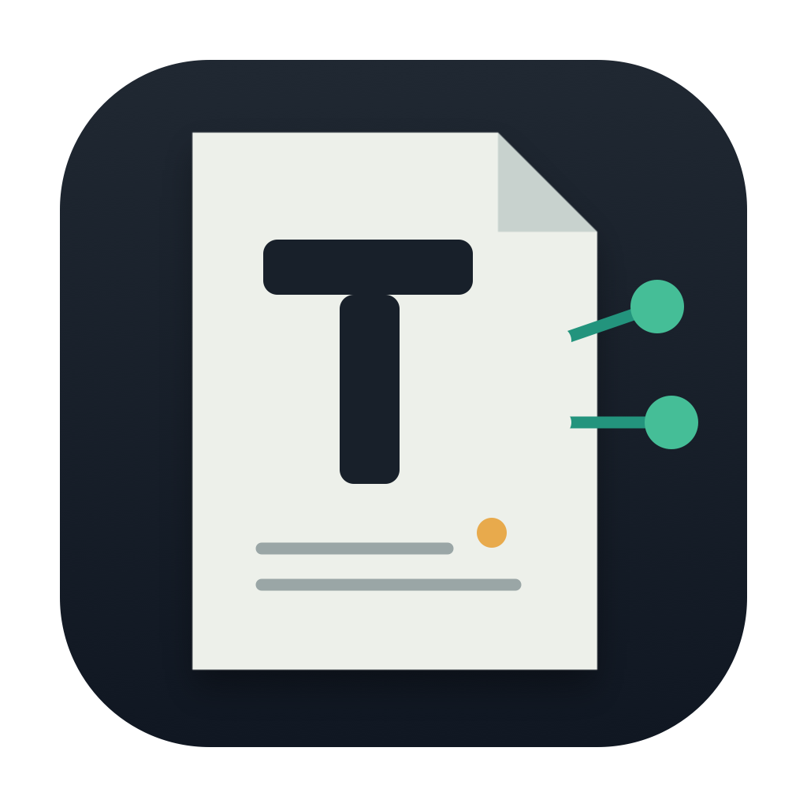
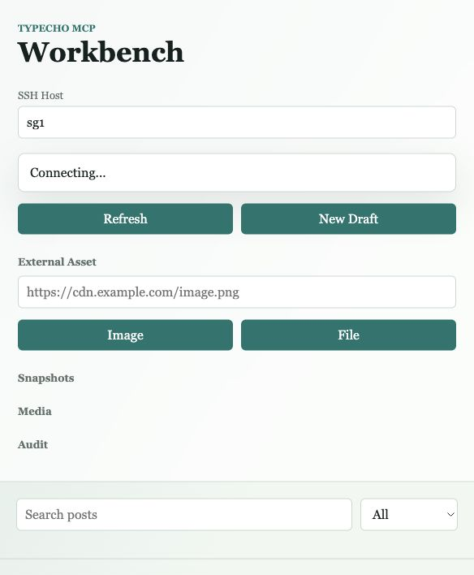
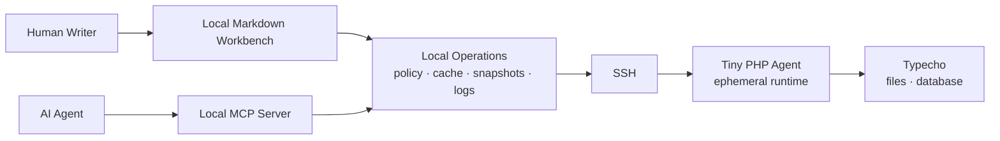
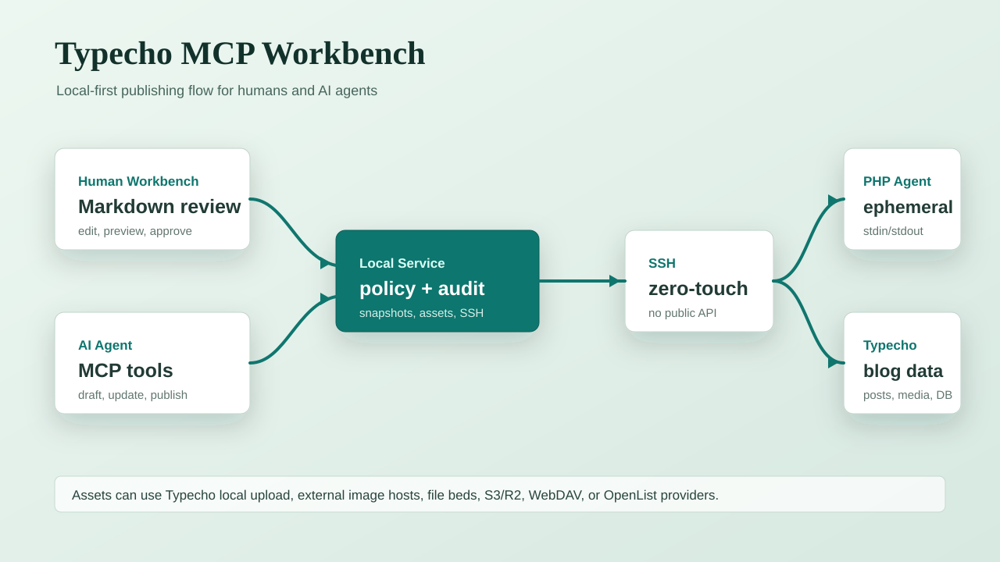
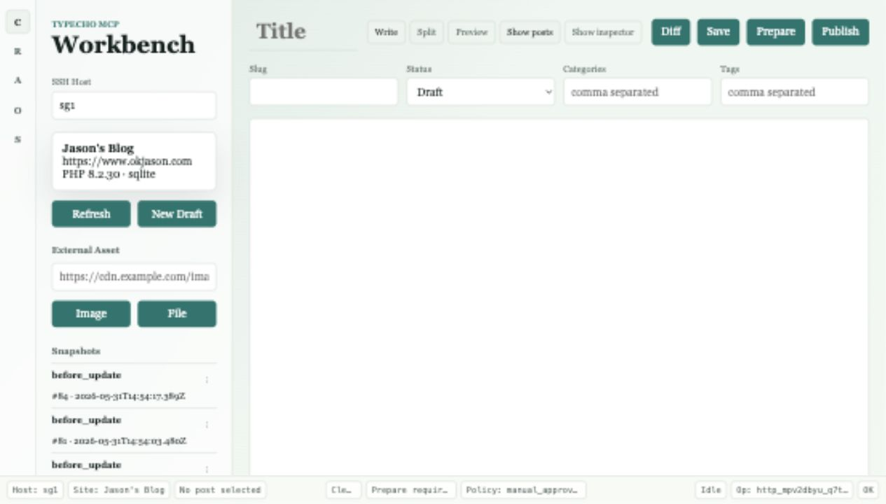
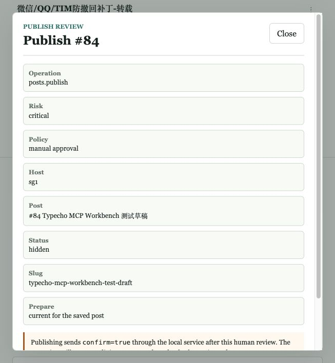
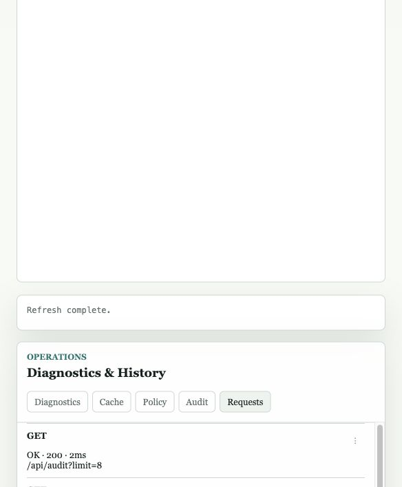
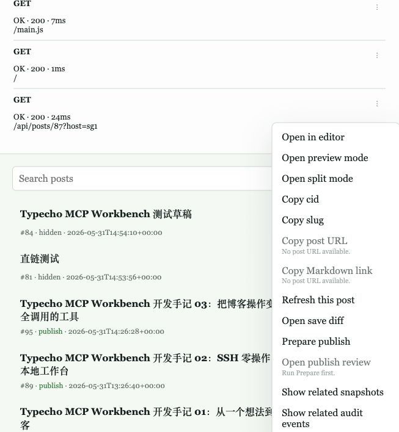
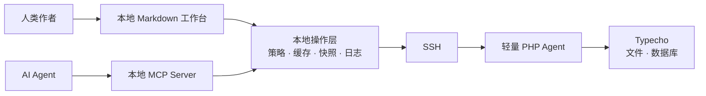

<p align="center">
  
</p>

<h1 align="center">Typecho MCP Workbench</h1>

<p align="center">
  Local-first Typecho publishing workbench for humans and AI agents.
  <br />
  用 SSH 把 Typecho 变成一个本地优先、可审计、可回滚的 MCP 发布工作台。
</p>

<p align="center">
  <a href="#english">English</a> ·
  <a href="#中文">中文</a> ·
  <a href="docs/architecture.md">Architecture</a> ·
  <a href="docs/security.md">Security</a> ·
  <a href="docs/roadmap.md">Roadmap</a>
</p>

<p align="center">
  
  
  
  
  
</p>



## English

**Typecho MCP Workbench** connects to an existing Typecho blog over SSH, deploys a tiny PHP agent with zero remote setup, and exposes two local interfaces:

- a Markdown workbench for human writing, review, diff, and publish confirmation
- a local MCP server for AI agents that draft, revise, upload media, and request publish actions

No public remote API. No Typecho admin plugin required. No long-running daemon on your server by default.

### Why

Typecho is small, fast, and loved by independent bloggers. But modern publishing workflows now include AI drafting, revision, media preparation, metadata checks, safety review, and rollback.

A traditional web admin panel is not the best interface for agent-operated publishing.

Typecho MCP Workbench turns your blog into a local, auditable publishing target while keeping the remote server lightweight.

### How It Works





### What Works Today

- SSH target detection for remote Typecho installations
- zero-touch PHP agent deploy/update
- CLI, MCP stdio server, local Web Workbench, and Tauri desktop alpha
- post list/detail, draft creation, update, publish confirmation, rollback
- media list/upload and external media URL registration
- local cache, durable request logs, audit logs, snapshots, and debug bundles
- Diff Preview before updates and Snapshot Preview before rollback
- Operation Policy for high-risk actions such as publish and rollback
- SQLite-first compatibility reporting and graceful unsupported-database errors

### Screenshots

| Writing Workspace | Publish Review |
| --- | --- |
|  |  |

| Operations Panel | Context Menu |
| --- | --- |
|  |  |

### Quick Start

Use an SSH alias from your local SSH config:

```bash
ssh your-ssh-alias
```

Probe a remote Typecho site:

```bash
node apps/local-service/src/cli.js probe --host your-ssh-alias
```

Deploy/check the PHP agent:

```bash
node apps/local-service/src/cli.js agent:health --host your-ssh-alias
```

List recent posts:

```bash
node apps/local-service/src/cli.js posts:list --host your-ssh-alias --limit 10
```

Start the local workbench:

```bash
TYPECHO_MCP_HOST=your-ssh-alias node apps/local-service/src/server.js
```

Open:

```text
http://127.0.0.1:4783
```

### MCP Usage

```bash
TYPECHO_MCP_HOST=your-ssh-alias node packages/mcp-server/src/server.js
```

Example MCP client config:

```json
{
  "mcpServers": {
    "typecho": {
      "command": "node",
      "args": ["/absolute/path/to/Typecho-MCP/packages/mcp-server/src/server.js"],
      "env": {
        "TYPECHO_MCP_HOST": "your-ssh-alias"
      }
    }
  }
}
```

Current MCP surfaces include site health, posts, media, audit logs, policy, cache, and snapshots. See [MCP Tools](docs/mcp-tools.md).

### Safety Model

Publishing is treated as a high-impact operation.

- SSH credentials stay local
- local HTTP binds to `127.0.0.1` by default
- publish requires explicit confirmation in the default policy
- updates create snapshots where possible
- audit logs and request logs are local-first
- debug bundles are designed for diagnosis without leaking secrets

See [Security Model](docs/security.md).

### Compatibility Boundary

The current alpha is **SQLite-first**.

Supported now:

- Typecho 1.2.x+
- SSH access to the host
- Docker-style deployments where Typecho can be reached from SSH
- SQLite-backed Typecho sites

Detected but not yet claimed for read/write support:

- MySQL / MariaDB
- PostgreSQL

Broader database support is planned read-only first, then write support only after adapter tests, policy, snapshots, audit, cache invalidation, and Typecho hook-compatibility are addressed.

### Roadmap

| Milestone | Status | Scope |
| --- | --- | --- |
| Usable first version | Mostly complete | SSH, PHP agent, MCP/CLI/Web, posts/media/snapshots |
| Trust core | First pass complete | diff, snapshot preview, policy, debug bundle, typed errors, timings |
| Workbench UX | Active | writing workspace, inspector, operations panel, review sheets |
| Desktop app | Alpha | Tauri shell, app icon, local service lifecycle |
| Database compatibility | Planned | MySQL/MariaDB read-only baseline before write support |
| Typecho management | Planned | pages, taxonomy, comments, plugins, settings as read-only first |

See [Roadmap](docs/roadmap.md).

### Development Series

A five-part build series is planned around the project:

1. [From idea to local-first Typecho MCP Workbench](https://www.okjason.com/archives/typecho-mcp-vibe-coding-01.html)
2. [SSH zero-touch deploy and the tiny PHP agent](https://www.okjason.com/archives/typecho-mcp-vibe-coding-02.html)
3. [MCP tools, snapshots, rollback, media, and audit logs](https://www.okjason.com/archives/typecho-mcp-vibe-coding-03.html)
4. [Designing the human writing workbench](https://www.okjason.com/archives/typecho-mcp-vibe-coding-04-workbench-desktop.html)
5. Safety, asset providers, desktop packaging, and the road to v1.0 — planned

Series materials live in [docs/series](docs/series/README.md). More public article links will be filled in as the posts are published.

### Star History

[](https://www.star-history.com/#JasonHe/Typecho-MCP&Date)

## 中文

**Typecho MCP Workbench** 是一个本地优先的 Typecho 远端管理与 AI 发布工作台。

它通过 SSH 连接已有 Typecho 博客，自动部署一个轻量 PHP agent，然后在本机提供：

- 给人使用的 Markdown 写作、预览、Diff、发布确认工作台
- 给 AI Agent 使用的本地 MCP Server

默认不暴露远端公开 API，不要求安装 Typecho 后台插件，也不需要在服务器上常驻一个新服务。

### 为什么做这个项目

Typecho 很轻，很适合独立博客。但 AI 参与写作之后，发布流程变复杂了：草稿、改写、配图、摘要、标签、SEO、发布确认、回滚，都需要一个比传统后台更适合“人机协作”的界面。

这个项目的目标不是让 AI 绕过人类发布文章，而是把 Typecho 变成一个可被 AI 安全操作、可被人类审阅确认的本地发布目标。

### 工作方式



### 当前已实现

- SSH 探测 Typecho 根目录和运行环境
- 自动上传和更新轻量 PHP agent
- 本地 CLI / MCP / Web Workbench / Tauri Alpha 桌面端
- 文章列表、详情、草稿、更新、发布确认、回滚
- 媒体上传、本地缓存、外链媒体登记
- Diff Preview、Snapshot Preview、Debug Bundle
- Operation Policy：默认人工确认发布
- 本地审计日志与回滚快照
- SQLite-first，兼容边界公开透明

### 快速开始

准备一个本地 SSH alias：

```bash
ssh your-ssh-alias
```

探测远端 Typecho：

```bash
node apps/local-service/src/cli.js probe --host your-ssh-alias
```

启动本地工作台：

```bash
TYPECHO_MCP_HOST=your-ssh-alias node apps/local-service/src/server.js
```

打开：

```text
http://127.0.0.1:4783
```

### 发布安全

默认策略是 `manual_approval`：AI 可以创建草稿、更新草稿、准备发布材料，但发布需要人类确认。

高风险操作会进入策略检查：

- 发布文章
- 修改已发布文章
- 回滚已发布文章
- 删除或覆盖内容
- 更改永久链接

### 当前状态

项目处于 Alpha / SQLite-first release-candidate 准备阶段。

适合：

- Typecho 用户试用本地 AI 发布工作流
- MCP 工具开发者参考真实内容发布场景
- 独立博客作者探索“AI 草稿 + 人类确认”的工作方式

暂不建议：

- 无审计地自动发布到生产博客
- 宣称完整支持所有数据库和所有主机面板
- 把本地 MCP HTTP 端口暴露到公网

### 参与贡献

欢迎贡献：

- 不同 Typecho 部署方式的探测样例
- MySQL / MariaDB 只读兼容测试
- MCP client 配置示例
- 发布确认 UI、Diff、Snapshot 体验改进
- 文档、截图、教程和开发手记

## License

This project is currently published for early public preview. A formal open-source license will be selected before the first stable release.
